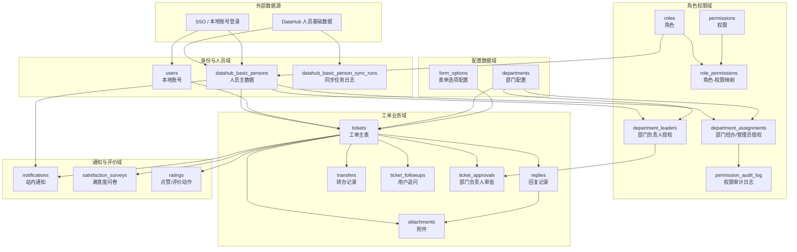
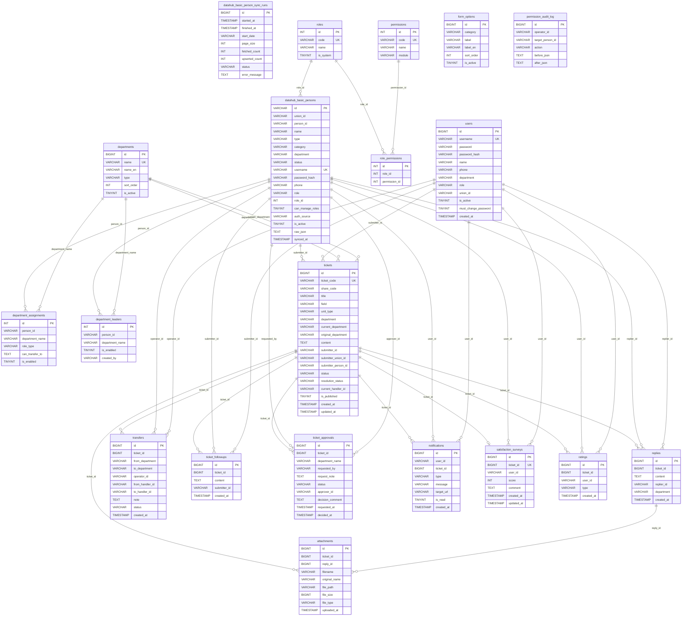

# 数据库表数据架构与关系图

> 来源：当前仓库 `server/db_mysql.js` 中的建表与迁移逻辑，以及 `server/index.js` 中的查询/写入关系。当前代码统一使用远程 MySQL，入口为 `server/db_mysql.js`。注意：这些表大多没有声明物理 `FOREIGN KEY`，下图按代码中的逻辑外键和查询关系整理。

## 一、表数据架构图

## 二、表关系图

## 三、表目录

| 数据域 | 表 | 说明 | 关键字段/约束 |
| --- | --- | --- | --- |
| 身份与人员 | `users` | 本地账号、后台创建账号、兼容旧登录 | `id` 主键；`username` 唯一；`union_id` 关联人员统一身份；迁移字段 `password_hash`、`is_active`、`must_change_password` |
| 身份与人员 | `datahub_basic_persons` | DataHub 同步来的人员主数据，也是 SSO 人员身份主表 | `id` 主键；`username` 唯一；`union_id` 索引；`role_id` 逻辑关联 `roles.id` |
| 身份与人员 | `datahub_basic_person_sync_runs` | DataHub 人员同步任务运行日志 | 记录开始/结束时间、拉取数量、入库数量、状态和错误信息 |
| 角色权限 | `roles` | 系统角色 | `code` 唯一；默认种子包含 `super_admin`、`dept_admin`、`liaison`、`user` |
| 角色权限 | `permissions` | 权限点 | `code` 唯一；按 `module` 分类 |
| 角色权限 | `role_permissions` | 角色与权限的多对多映射 | `(role_id, permission_id)` 唯一 |
| 配置 | `departments` | 可选择和授权的部门配置 | `name` 唯一；`type` 区分职能处室/教学科研机构 |
| 配置 | `form_options` | 工单表单选项配置 | `(category, label)` 唯一；目前主要用于 `fields` |
| 部门授权 | `department_assignments` | 人员经办/管理员授权 | `(person_id, department_name)` 唯一；`can_transfer_to` 存储可转办目标 |
| 部门授权 | `department_leaders` | 部门负责人授权 | `(person_id, department_name)` 唯一 |
| 部门授权 | `permission_audit_log` | 权限变更审计 | 记录操作者、目标人员、动作、变更前后 JSON |
| 工单 | `tickets` | 工单主表 | `id` 主键；`ticket_code` 唯一索引；包含提交人快照、当前部门、状态、发布状态 |
| 工单 | `replies` | 工单回复 | `ticket_id` 关联工单；`replier_id` 关联人员/用户 |
| 工单 | `attachments` | 工单或回复附件 | `ticket_id`、`reply_id` 二选一或同时用于归属查询 |
| 工单 | `transfers` | 转办记录 | `ticket_id` 关联工单；`operator_id` 为转办人；`status` 表示 active/superseded |
| 工单 | `ticket_followups` | 提交人追问 | `ticket_id` 关联工单；`submitter_id` 关联人员/用户 |
| 审批 | `ticket_approvals` | 部门负责人审批请求 | `ticket_id` 关联工单；`requested_by`、`approver_id` 关联人员 |
| 通知评价 | `notifications` | 站内通知 | `user_id` 为接收人；`ticket_id` 可为空，用于系统通知 |
| 通知评价 | `satisfaction_surveys` | 满意度调查 | `ticket_id` 唯一，表示一张工单最多一份满意度 |
| 通知评价 | `ratings` | 用户评价/点赞等动作 | `(ticket_id, user_id, type)` 唯一 |

## 四、核心业务关系说明

1. **人员身份双轨兼容**：`datahub_basic_persons` 是远程/SSO 人员主数据，`users` 保留本地账号和历史兼容。工单、回复、通知等表中的用户字段通常用 `VARCHAR` 保存人员 ID 或本地账号 ID，因此图中同时标出到 `datahub_basic_persons` 和 `users` 的逻辑关联。
2. **角色权限链路**：`datahub_basic_persons.role_id -> roles.id -> role_permissions.role_id -> permissions.id` 构成 RBAC 权限链路；`users.role` 是旧/本地账号兼容字段。
3. **部门授权链路**：`department_assignments` 表示部门经办/管理员，`department_leaders` 表示部门负责人；两者通过 `person_id` 关联人员，通过 `department_name` 逻辑关联 `departments.name`。
4. **工单主链路**：`tickets` 是中心表，`replies`、`attachments`、`transfers`、`ticket_followups`、`ticket_approvals`、`notifications`、`satisfaction_surveys`、`ratings` 都围绕 `ticket_id` 展开。
5. **附件归属**：附件可直接挂在工单上，也可挂在某条回复上；回复附件通过 `attachments.reply_id -> replies.id` 再回到工单。
6. **满意度与评价**：`satisfaction_surveys.ticket_id` 唯一，适合表达一次最终满意度；`ratings` 允许同一用户对同一工单按不同 `type` 做不同评价。

## 五、维护注意事项

- 当前建表 SQL 未声明物理外键，删除工单时需要应用层同步清理相关数据和文件；若后续补充外键，需要先清理历史孤儿数据。
- 部门关系多处使用部门名称字符串而不是 `departments.id`，改名部门时要同步评估历史工单、授权和审批记录。
- `users.password` 与 `users.password_hash` 并存，`scripts/migrate-db.sql` 会把旧密码迁移到 `password_hash`；后续认证逻辑应优先使用哈希字段。
- `notifications.ticket_id` 已迁移为可空，用于不依附工单的系统通知。
