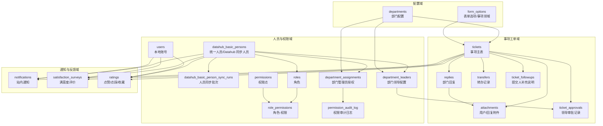
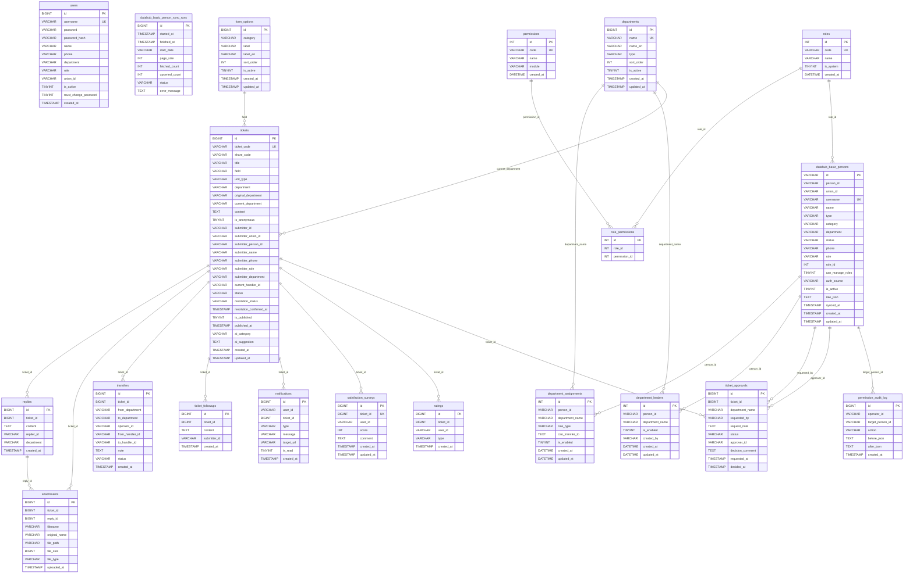
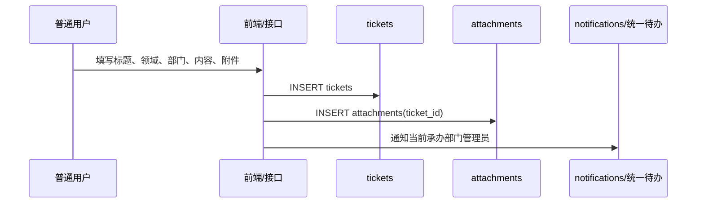
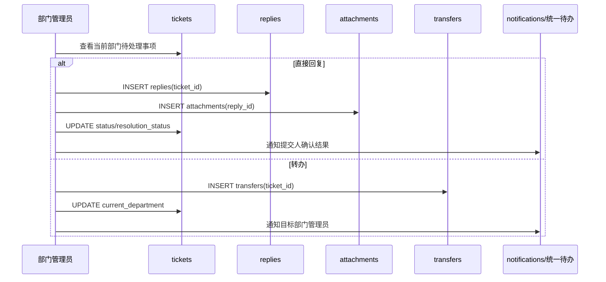
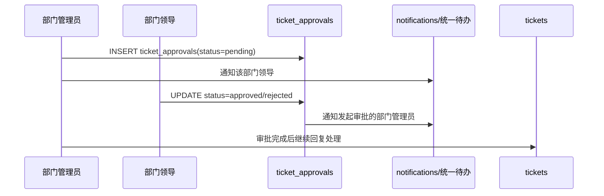
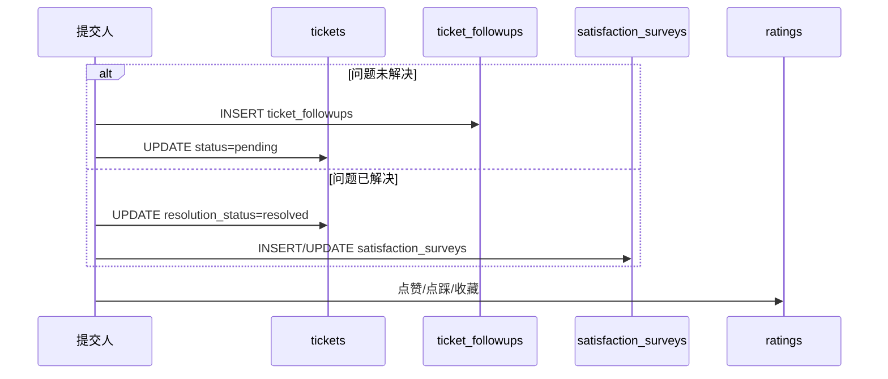

# SIGS 接诉即办数据库表结构与关系图

本文档根据 `server/db_mysql.js` 中的 MySQL 初始化逻辑和 `server/index.js` 中的主要业务查询整理。

说明：

- 当前数据库主要使用 MySQL/InnoDB，字符集为 `utf8mb4`。
- 代码里大部分关系通过应用层字段维护，例如 `ticket_id`、`person_id`、`department_name`、`user_id`。
- 表结构中多数未显式声明 `FOREIGN KEY`，下图表达的是业务关系和联表关系，不代表数据库强约束全部存在。
- `submitter_id`、`user_id`、`operator_id`、`replier_id` 等字段历史上兼容本地账号 `users.id` 与统一人员表 `datahub_basic_persons.id`，因此在图中按“可能关联”表达。

## 1. 业务域分层架构图

## 2. 核心关系图 ERD

## 3. 主要业务流程与数据流

### 3.1 提交事项

相关表：

| 表 | 作用 |
| --- | --- |
| `tickets` | 事项主记录，保存标题、领域、部门、提交人快照、状态 |
| `attachments` | 用户提交附件，`ticket_id` 指向事项 |
| `notifications` | 给部门管理员、提交人、领导发送站内通知 |
| `departments` | 提交表单中的部门来源 |
| `form_options` | 提交表单中的事项领域来源 |

### 3.2 部门处理、回复与转办

相关表：

| 表 | 作用 |
| --- | --- |
| `replies` | 部门管理员处理回复 |
| `attachments` | 回复附件，`reply_id` 指向回复记录 |
| `transfers` | 转办历史，当前有效记录 `status='active'` |
| `tickets.current_department` | 当前承办部门 |
| `department_assignments` | 判断哪些人员有部门管理员权限 |

### 3.3 领导审批

相关表：

| 表 | 作用 |
| --- | --- |
| `department_leaders` | 维护部门领导和部门的对应关系 |
| `ticket_approvals` | 记录一次领导审批请求、审批人、审批意见 |
| `notifications` | 领导待审批通知、审批结果通知 |
| `tickets` | 审批期间保持待处理状态，审批完成后由管理员继续处理 |

### 3.4 满意度与互动

相关表：

| 表 | 作用 |
| --- | --- |
| `ticket_followups` | 提交人补充说明，工单重新进入待处理 |
| `satisfaction_surveys` | 满意度评分与评价，一张工单唯一一条评价 |
| `ratings` | 点赞、点踩、收藏等用户互动 |

## 4. 表清单与字段重点

| 业务域 | 表 | 主键 | 关键字段 | 说明 |
| --- | --- | --- | --- | --- |
| 人员账号 | `users` | `id` | `username`, `union_id`, `role`, `department` | 本地账号与兼容账号 |
| 人员账号 | `datahub_basic_persons` | `id` | `union_id`, `name`, `department`, `role_id`, `is_active` | 统一人员库同步数据，也是权限授权主要人员来源 |
| 人员账号 | `datahub_basic_person_sync_runs` | `id` | `status`, `fetched_count`, `upserted_count` | Datahub 同步批次记录 |
| RBAC | `roles` | `id` | `code`, `name` | 系统角色 |
| RBAC | `permissions` | `id` | `code`, `module` | 权限点 |
| RBAC | `role_permissions` | `id` | `role_id`, `permission_id` | 角色权限关联 |
| 配置 | `departments` | `id` | `name`, `name_en`, `type`, `is_active` | 部门配置 |
| 配置 | `form_options` | `id` | `category`, `label`, `label_en`, `is_active` | 事项领域等表单选项 |
| 工单 | `tickets` | `id` | `ticket_code`, `current_department`, `status`, `submitter_id` | 事项主表 |
| 工单 | `replies` | `id` | `ticket_id`, `replier_id`, `department` | 部门处理回复 |
| 工单 | `attachments` | `id` | `ticket_id`, `reply_id`, `original_name`, `file_path` | 用户附件和回复附件 |
| 工单 | `transfers` | `id` | `ticket_id`, `from_department`, `to_department`, `status` | 转办记录 |
| 工单 | `ticket_followups` | `id` | `ticket_id`, `submitter_id` | 用户补充说明 |
| 通知 | `notifications` | `id` | `user_id`, `ticket_id`, `type`, `target_url`, `is_read` | 站内通知 |
| 反馈 | `satisfaction_surveys` | `id` | `ticket_id`, `user_id`, `score` | 满意度评价 |
| 反馈 | `ratings` | `id` | `ticket_id`, `user_id`, `type` | 点赞、点踩、收藏 |
| 授权 | `department_assignments` | `id` | `person_id`, `department_name`, `role_type`, `can_transfer_to` | 部门管理员授权 |
| 授权 | `department_leaders` | `id` | `person_id`, `department_name`, `is_enabled` | 部门领导配置 |
| 授权 | `permission_audit_log` | `id` | `operator_id`, `target_person_id`, `action` | 授权变更审计 |
| 审批 | `ticket_approvals` | `id` | `ticket_id`, `department_name`, `status`, `approver_id` | 领导审批记录 |

## 5. 关键索引与唯一约束

| 表 | 约束/索引 | 作用 |
| --- | --- | --- |
| `users` | `username UNIQUE` | 本地账号唯一 |
| `tickets` | `idx_tickets_submitter_id`, `uniq_tickets_ticket_code` | 按提交人查询、按工单编号访问 |
| `replies` | `idx_replies_ticket_id`, `idx_replies_replier_id` | 按工单查回复、按回复人查记录 |
| `attachments` | `idx_attachments_ticket_id`, `idx_attachments_reply_id` | 区分用户附件和回复附件 |
| `transfers` | `idx_transfers_ticket_id`, `idx_transfers_operator_id` | 查工单转办链路 |
| `notifications` | `idx_notifications_ticket_id` | 查工单关联通知 |
| `satisfaction_surveys` | `uniq_satisfaction_ticket` | 一张工单一条满意度 |
| `ratings` | `uniq_rating_ticket_user_type` | 同一用户对同一工单同一互动类型唯一 |
| `roles` | `code UNIQUE` | 角色编码唯一 |
| `permissions` | `code UNIQUE` | 权限编码唯一 |
| `role_permissions` | `uniq_role_permission` | 避免重复授权 |
| `datahub_basic_persons` | `username UNIQUE`, `idx_datahub_basic_persons_union_id`, `idx_datahub_basic_persons_department` | 人员查找、部门授权检索 |
| `form_options` | `uniq_category_label`, `idx_form_options_category`, `idx_form_options_active` | 表单配置查询 |
| `departments` | `name UNIQUE` | 部门中文名唯一 |
| `department_assignments` | `uniq_person_department`, `idx_department_assignments_person_id`, `idx_department_assignments_department_name` | 人员-部门授权唯一 |
| `department_leaders` | `uniq_department_leaders_person_department`, `idx_department_leaders_person_id`, `idx_department_leaders_department_name` | 部门领导配置唯一 |
| `ticket_approvals` | `idx_ticket_approvals_ticket_id`, `idx_ticket_approvals_status` | 审批列表和审批状态查询 |

## 6. 关系注意事项

1. `tickets.submitter_id`、`notifications.user_id`、`ratings.user_id`、`satisfaction_surveys.user_id` 是字符串字段，历史上兼容本地 `users.id` 与统一人员 `datahub_basic_persons.id`。
2. `department_name` 和 `current_department` 是按部门中文名关联 `departments.name`，不是按部门 `id` 关联。
3. `attachments` 同时支持两类附件：
   - 用户提交附件：`ticket_id` 有值，`reply_id` 为空。
   - 部门回复附件：`reply_id` 有值，可通过 `replies.ticket_id` 回到事项。
4. `ticket_approvals` 不直接改变 `tickets.status` 为审批状态，审批中状态主要通过存在 `pending` 审批记录判断。
5. `permission_audit_log` 记录授权变更前后 JSON 快照，不参与业务强约束。
6. 统一待办不落独立业务表，主要由代码调用外部接口推送；本系统内部只保存 `notifications`。
